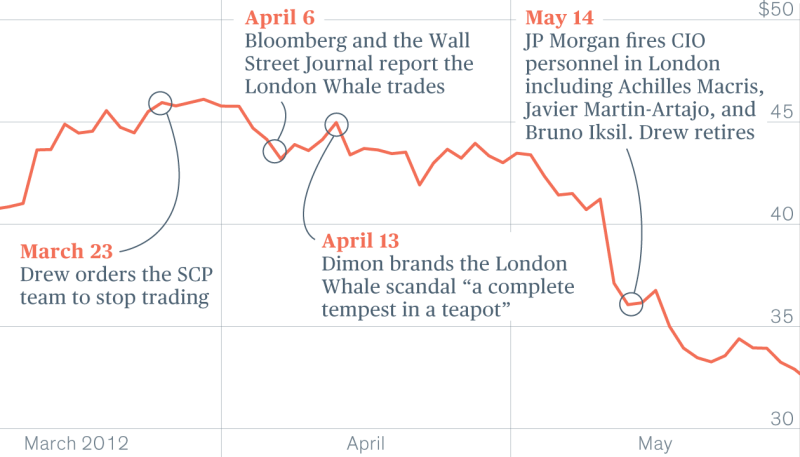

#  20120513_摩根大通“伦敦鲸”事件

## 事件简述
市场：债券洐生品指数市场  
品种：与125家企业债相关的CDS指数  
日期：2012年5月13日  
多方：对冲基金的投资者们  
空方：摩根大通的首席投资办公室（CIO）布鲁诺·伊克希尔即伦敦鲸  
结果：摩根大通产生高达65亿美元的巨额亏损，CIO掌门人伊娜·德鲁离职，摩根大通信用评级下调，并被处以9.2亿美元的巨额罚款，该事件甚至在欧美信贷市场掀起剧烈波动。	

## 背景介绍

(一) [摩根大通](https://baike.baidu.com/item/%E6%91%A9%E6%A0%B9%E5%A4%A7%E9%80%9A?fromModule=lemma_search-box#8) ：总部在美国纽约，是2000年由大同曼哈顿银行及J.P.摩根公司合并而成，总资产高达2.5万亿美元，是美国最大金融服务机构之一。 其内部下设首席投资办公室（简称CIO），用来管理信贷资产组合。2012年5月，因为风险对冲的投资决策失败，摩根大通损失65亿美元，是该公司发展史上一次无法绕过的重大事件。

(二) [信用违约互换（CDX)](https://baike.baidu.com/item/%E4%BF%A1%E7%94%A8%E8%BF%9D%E7%BA%A6%E4%BA%92%E6%8D%A2?fromModule=lemma_search-box) ：是一种很常见的信用衍生产品，是指在一定的期限内，买卖双方对共同约定的某个信用时间进行风险转换的合约，具有产品定义简单、操作容易、交易简洁等特点，迅速在国际金融市场得到了发展。

## 事件概述

2012年摩根大通是世界第二大银行，资产总额高达2.509万亿美元，业务范围覆盖资产管理、私人银行、私人财富管理、资金及证券服务等部门，值得注意的是摩根大通有着优异的风险管理历史，被公认为是风险管理实践最好的银行之一，甚至在2008年美国次贷危机中，摩根大通由于其优秀的风险管理几乎丝毫未损。

CIO是摩根大通的一个最赚钱的业务部门，它主要从事债券洐生品指数的投资工作，简而言之就是摩根大通买了很多证券，需要CIO部门用衍生品来对冲风险。而CIO也不负所托，每年都会为摩根大通赚取巨额利润，尤其在2008-2009年的金融危机中，摩根大通能够挺过难关，全靠CIO，据统计仅在2008-2009年两年间，CIO一个部门的利润总额就超过摩根大通同期利润的五分之一，正是由于多年的出众表现为CIO赢得了良好的声誉。

但凡事均有两面性，也是由于CIO出众的表现，使得摩根大通管理层放松了对其投资决策的监管，甚至还为它的某些决策开了后门。

伦敦鲸事件就发生在CIO的鼎盛时期，当地时间2012年3月20日，当时摩根大通公司CIO的交易员布鲁诺·伊克希尔为对冲CIO的投资以及整个摩根大通作为贷款人的风险，开始大量卖出10年期的CDX指数，并买入5年期的CDX.NA.IG9指数，此时市场上的对冲基金则大量买入他们认为相对便宜的10年期CDX，卖出CIO认为相对贵的5年期CDX。

按照惯例随着对冲基金们大量买入10年期的CDX，该指数应该上涨，但实际上该指数价格依然很低，此时对冲基金便猜测到是摩根大通的CIO交易部门的交易员在幕后操纵CDX市场，因为这么大的交易量，只有CIO有实力做到，于是对冲基金开始反方向操作套利。

而此时随着欧债危机愈演愈烈、经济复苏也远低于期望，从2012年4月起，CDX指数果真未按照CIO操作员的预期进行涨跌，而是向相反方向发展，这就宣告了CIO交易员布鲁诺·伊克希尔空头交易策略的失败，此次事件最终在各路对冲基金的追击下，摩根大通不得不强行平仓、撤离战场，此次风波最终导致摩根大通损失高达65亿美元。

5月13日，为平息舆论风波，摩根大通公司甚至公开就该事件向社会道歉，由此导致摩根大通股价暴跌9.3%，收报36.96美元，市值一夜之间蒸发了150亿美元。
## 事件后续
 “伦敦鲸事件”的发生绝非偶然，它是摩根大通在内忧外患的共同作用下所发生的一次管理事故，外部原因包括欧债危机、美国宏观经济数据、媒体的穷追猛打等，这一切都让CIO交易员始料未及，但究其根本还是摩根大通内部风险管理的缺陷：一是缺少有效风险管控约束机制，因为CIO此前良好的盈利记录，便放松对其交易风险的重视，这点所有银行都应注意;二是未能充分考虑风险计量模型局限性，摩根大通素来以优秀的风险管理著称，但自家的风险价值（VAR）指标却没有充分考虑市场环境恶化所带来的集中度、市场流动性和资产相关性等风险因素影响,这要是传出去一定会让人笑掉大牙；三是低估交易规模对市场流动性的冲击，CIO的信用衍生品交易可能高达1000亿美元，约占该产品市场份额的2/3，这意味着交易组合对市场波动非常敏感，市场价格微小变化可能造成重大损失，且难以在短时间内顺利平盘。

摩根大通的“伦敦鲸”事件已落下帷幕，但摩根大通在此事件中所遭受的损失却永远无法弥补，此时我们作为观众也彻底看清了信用衍生品的破坏威力究竟有多大，同时也认识到金融行业加强对信用衍生品的监管和集中清算的重要性。这也为我们投资者敲响了警钟：利润固然重要，但也要考虑风险的大小，一定要在能力范围内实现资产盈利的最优化，切忌用赌徒的心态来投资。
	
## 相关视频
[【金融风险案例】摩根大通的伦敦鲸⑦](https://www.bilibili.com/video/BV1WZ4y1W78v?vd_source=afeaf1bbefec5c4f552772f6a2290b8b)
## 相关链接
[摩根大通CIO真面](https://www.docin.com/p-1014149588.html)
			 
[摩根大通因“伦敦鲸”事件遭重罚](http://m.ldnews.cn/pcarticle/235306?mobile)
			 
[摩根大通“伦敦鲸”巨额亏损门全方位解读](http://finance.sina.com.cn/world/20120512/025312050355.shtml)
			 
[美媒揭秘“伦敦鲸”案幕后 称暴露美监管机制漏洞](https://www.chinanews.com/fortune/2013/08-19/5178713.shtml)
			 
[摩根大通伦敦鲸事件分析](https://www.weivol.cn/2018/01/london-whale/)
